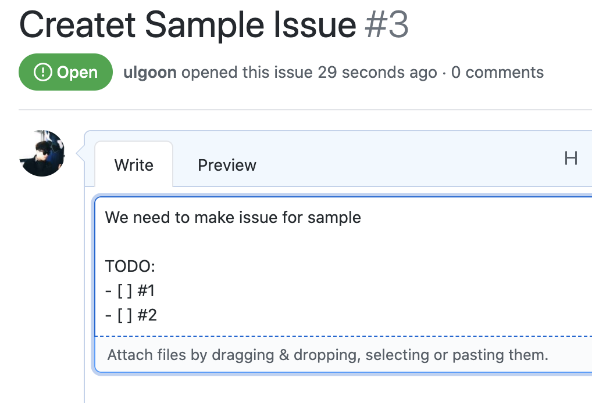
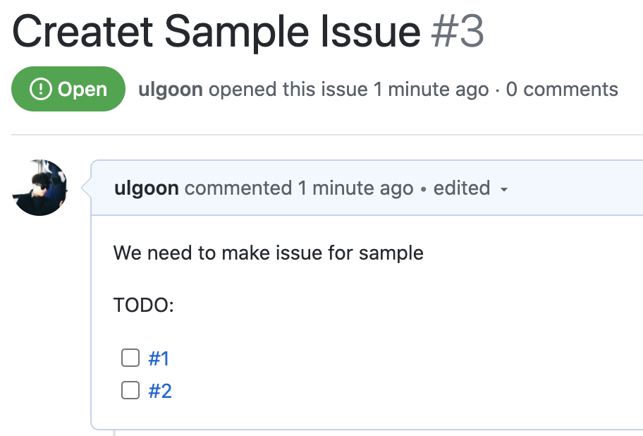
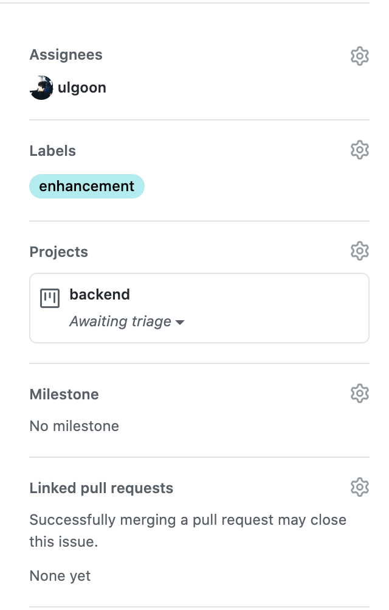
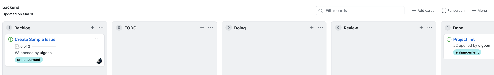

# git (2)

## Fastcampus Programming SCHOOL

---

<!--
paginate: true
theme: default
size: 16:9
footer : fastcampus, Wooyoung Choi, 2020
-->

## Branch

---

## What is branch?

---

## What is branch?(1)


---

## What is branch?(2)

분기점을 생성하고 독립적으로 코드를 변경할 수 있도록 도와주는 모델

ex)

master branch

```python
print('hello world!')
```

another branch

```python
for i in range(1,10):
    print('hello world for the %s times!' % i)
```

---

## Branch(1)

Show available local branch
`$ git branch`

Show available remote branch
`$ git branch -r`

Show available All branch
`$ git branch -a`

---

## Branch(2)

Create branch
`$ git branch stem`

Checkout branch
`$ git checkout stem`

Create & Checkout branch
`$ git checkout -b new-stem`

make changes inside readme.md
`$ git commit -a -m 'edit readme.md'`
`$ git checkout master`

merge branch
`$ git merge stem`

---

## Branch(3)

delete branch
`$ git branch -D stem`

push with specified remote branch
`$ git push origin stem`

see the difference between two branches
`$ git diff master stem`

---

## Branch asciinema

[](https://asciinema.org/a/qRmUXvtrkXS6Y09H9TM1hVAhT)

---

## branching models

- git flow
  - (hotfix)- `master` -(release)- `develop` - feature
  - pros: 가장 많이 적용, 각 단계가 명확히 구분
  - cons: 복잡..
- github flow
  - `master` - feature
  - pros: 브랜치 모델 단순화, `master`의 모든 커밋은 deployable
  - cons: CI 의존성 높음. 누구 하나라도 실수했다간..(pull request로 방지)
- gitlab flow
  - `production` - `pre-production` - `master` - feature
  - pros: deploy, issue에 대한 대응이 가능하도록 보완
  - cons: git flow와 반대 (`master`-develop, `production`-master)

---

## git flow strategy


---

## use git flow easily!

[Link](https://danielkummer.github.io/git-flow-cheatsheet/index.ko_KR.html)


---

## Collaborate with your Co-worker

---

## Method 1: Collaboration

Add Collaborator


---

## Collaboration

Add, Commit and Push like you own it. 

---

## Method 2: Fork and Merge


---

## Fork and Merge


---

## Fork and Merge


---

## Fork and Merge

`$ git clone https://github.com/username/forked-repo.git`

---

## Fork and Merge

`$ git branch -a`
`$ git checkout -b new-feature`

---

## Fork and Merge

Make some change

`$ git add file`
`$ git commit -m "commit message"`
`$ git push origin new-feature`

---

## Fork and Merge


---

## Fork and Merge


---

## Fork and Merge


---

## Fork and Merge


---

## Fork and Merge


---

## Fork and Merge


---

## Fork and Merge


---

## continuous pull

---

## continuous pull

`$ git remote add upstream https://github.com/anotheruser/original-repo.git`

`$ git fetch upstream`
`$ git merge upstream/master`

---

## How to move files

### Don't

```shell
$ mv style.css static/css
```
-> deleted:
-> untracked files:

### Do

```shell
$ git mv style.css static/css
```
-> renamed:

---

## Issue & Projects

Issue: 프로젝트, 레포와 관계된 모든 해야할 일과 버그, 개선사항 등을 기록

Projects: 해야할 일의 진도에 따른 구성과 우선순위 지정

---

### Issue(1)



---

### Issue(2)



---

### Issue(3-1)



---

### Issue(3-2)

- Assignees: 이 이슈에 대한 책임인원
- Labels: 이슈의 종류
- Projects: 이슈를 배당할 프로젝트
- Milestone: 이슈에 해당하는 중요 시점 지정

---

### Projects

---

### Projects(2)



<link href="https://fonts.googleapis.com/css?family=Nanum+Gothic:400,800" rel="stylesheet">
<link rel='stylesheet' href='//cdn.jsdelivr.net/npm/hack-font@3.3.0/build/web/hack-subset.css'>

<style>
h1,h2,h3,h4,h5,h6,
p,li, dd, table > * > * {
font-family: 'Nanum Gothic', Gothic;
}
span, pre {
font-family: 'Hack', monospace;
}
</style>